<h1 align="center">Hi, I'm Wang Xu 👋</h1>

  <em>Client-side Developer | React Native • iOS • Frontend</em>

  
  

## 🚀 About
- Client-side developer focused on mobile apps and modern frontend engineering.
- Experienced with React Native, Expo, and web tooling.
- Build clean, reliable, and fast user experiences.

## 🧩 Tech Stack + Languages

  

  Made with ❤️ by Wang Xu

